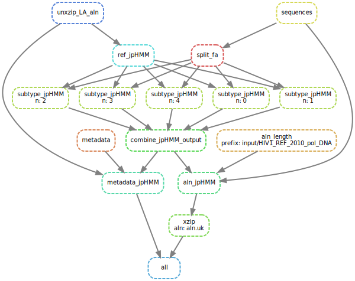
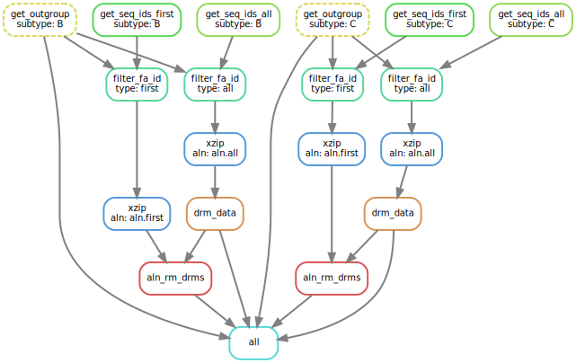
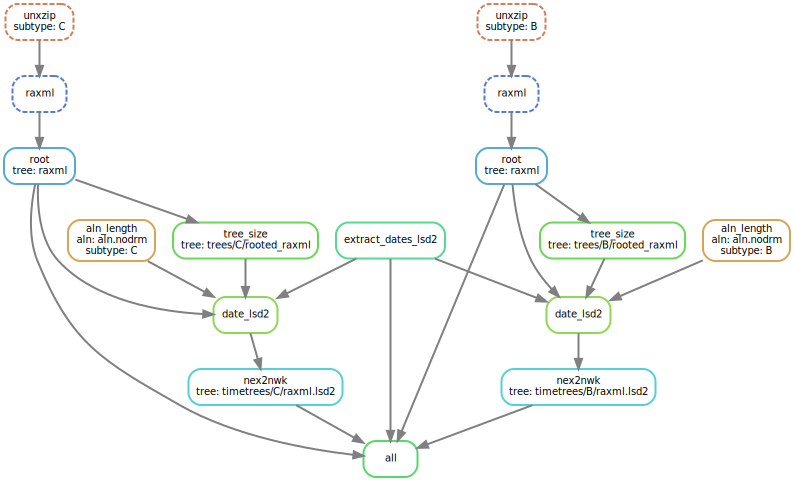
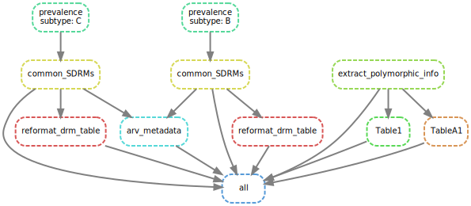
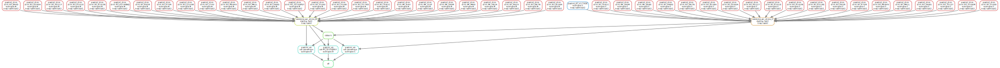
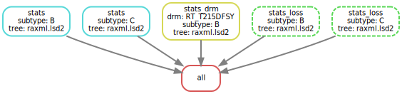

# Drug resistance emergence and transmission in HIV-1 in the UK

This repository contains the pipelines and resulting data from the analyses of drug resistance patterns in the UK.
The analyses are described in the article below:

### Article
Zhukova A., Dunn D., Tostevin A., Gascuel O., on behalf of the UK HIV Drug Resistance
Database & the Collaborative HIV, Anti-HIV Drug Resistance Network. __Modelling drug resistance emergence and transmission in HIV-1
in the UK__ [2023]()

### Input data
We used the data from the UK HIV Drug Resistance Database [[Dunn and Pillay 2007](https://pubmed.ncbi.nlm.nih.gov/18578092/)]:
protease (PR) and reverse transcriptase (RT) sequences extracted during the resistance tests and the corresponding
metadata (e.g., treatment status of the patient before the test: treatment-experienced, -naive,
or unknown; and the date of the test). Such data can be requested from the Database.


### Pipelines
The Snakemake [[Köster *et al.*, 2012](https://doi.org/10.1093/bioinformatics/bts480)] pipepiles for data analyses can be found in the [snakemake](folder).

They include:
#### 1. Subtyping pipeline [Snakemake_subtype](snakemake/Snakemake_subtype)

This pipeline first reads and reformats the input data provided 
by the UK HIV Drug Resistance database (sequences and metadata). 
It then subtypes and aligns the sequences with jpHMM [[Schultz _et al._ 2006]](https://doi.org/10.1
186/1471-2105-7-265) against the reference _pol_ alignment from the Los Alamos HIV database [[Kuiken _et al._ 2003](https://www.ncbi.nlm.nih.gov/pmc/articles/PMC2613779/)].

##### Input data:

The input data is assumed to be placed in the [data/input](data/input) folder and contain:
* a fasta file sequences.fasta.xz with the input sequences;
* a comma-separated metadata file with the following columns: 
  * patientindex --id of the patient, allowing to identify sequence samples from the same patient;
  * sequence_id -- id of the sequence, corresponding to the ids in the fasta file. This is assumed to be the second column. 
  * sampledate_my -- sequence sampling date in MM/YYYY format;
  * treatmentstatus -- treatment status before the sample:  1 (naive), 2 (experienced), or 3 (unknown).

We do not provide the above two files. They should be requested from the UK HIV Drug Resistance Database.

* the reference _pol_ alignment: provided in [data/input/HIV1_REF_2010_pol_DNA.fa.xz](data/input/HIV1_REF_2010_pol_DNA.fa.xz).

The pipeline subtypes and aligns the sequences with jpHMM [[Schultz _et al._ 2006]](https://doi.org/10.1
186/1471-2105-7-265) against the reference POL alignment from the Los Alamos HIV database [[Kuiken _et al._ 2003](https://www.ncbi.nlm.nih.gov/pmc/articles/PMC2613779/)] 
(provided in [HIV1_REF_2010_pol_DNA.fa.xz](data/input/HIV1_REF_2010_pol_DNA.fa.xz)).

##### Output data:
This pipeline outputs:
* an alignment file aln.uk.fa.xz (in the [data/aln](data/aln) folder, not provided) 
* a tab-delimited metadata file [data/metadata/metadata.uk.tab](data/metadata/metadata.uk.tab)
with the following columns:
  * id -- sequence id (the first column);
  * patientindex	-- patient id ;
  * sampledate_my	-- sequence sampling date in MM/YYYY format;
  * treatmentstatus -- treatment status before the sample: 'naive' or 'experienced'; if the value is left blank it means that the status is unknown;
  * subtype_jpHMM -- sequence subtype.


##### DIY
```bash
snakemake --snakefile Snakefile_subtype --keep-going --cores 4 --use-singularity --singularity-args "--home ~"
```


#### 2. B and C dataset preparation pipeline [Snakemake_aln](snakemake/Snakemake_aln)

This pipeline extracts alignments corresponding to subtypes B and C 
(adding 5 sequences of other pure subtypes as outgroups), 
keeping one sequence per patient (the first sample); 
extracts the DRM information for their sequences with [sierrapy](github.com/hivdb/sierra-client); 
and removes the DRM positions from these alignments.

##### Input data:
* an alignment file aln.uk.fa.xz (in the [data/aln](data/aln) folder, not provided);
* a tab-delimited metadata file [data/metadata/metadata.uk.tab](data/metadata/metadata.uk.tab)
with (at least) the following columns:
  * id -- sequence id  (the first column);
  * patientindex	-- patient id ;
  * sampledate_my	-- sequence sampling date in MM/YYYY format;
  * subtype_jpHMM -- sequence subtype.


##### Output data:
* alignment files aln.nodrm.fa.xz without DRM positions 
for subtypes B and C (in the [data/aln/B](data/aln/B) and [data/aln/C](data/aln/C) folders, not provided);
* outgroup files (containing five outgroup sequence ids, one per line)
for B and C,
[data/aln/B/outgroup.tab](data/aln/B/outgroup.tab) 
and [data/aln/C/outgroup.tab](data/aln/C/outgroup.tab);
* tab-delimited DRM metadata files for B and C,
[data/metadata/B/metadata.drm.tab](data/metadata/B/metadata.drm.tab) and [data/metadata/C/metadata.drm.tab](data/metadata/C/metadata.drm.tab),
with the following columns:
  * inputSequence -- sequence id  (the first column);
  * drm columns, e.g. PR_L10F -- the value is either 'sensitive' (if the amino acid is position PR:10 is known and not F), 'resistant' (if it's F) or blank (if the amino acid is unknown).


##### DIY
```bash
snakemake --snakefile Snakefile_aln --keep-going --cores 4 --use-singularity --singularity-args "--home ~"
```



### 3. Time-scaled tree (for B and C) reconstruction pipeline [Snakemake_trees](snakemake/Snakemake_trees)

The pipeline reconstructs phylogenetic trees for B and C with RAxML-NG [[Stamatakis, 2014](https://doi.org/10.1093/bioinformatics/btu033)] (model: GTR+G4+FO+IO),
roots it with an outgroup (which is removed after rooting) and dated with LSD2 [[To *et al.*, 2015](https://academic.oup.com/sysbio/article/65/1/82/2461506)] (with outlier removal). 


##### Input data:
* alignment files aln.nodrm.fa.xz without DRM positions 
for subtypes B and C (in the [data/aln/B](data/aln/B) and [data/aln/C](data/aln/C) folders, not provided);
* outgroup files (containing five outgroup sequence ids, one per line)
for B and C:
[data/aln/B/outgroup.tab](data/aln/B/outgroup.tab) 
and [data/aln/C/outgroup.tab](data/aln/C/outgroup.tab);
* tab-delimited metadata file [data/metadata/metadata.uk.tab](data/metadata/metadata.uk.tab)
with (at least) the following columns:
  * id -- sequence id (the first column);
  * sampledate_my	-- sequence sampling date in MM/YYYY format.

##### Output data:
* rooted phylogenetic trees for B and C in newick format (without outgroup): [data/trees/B/rooted_raxml.nwk](data/trees/B/rooted_raxml.nwk) and [data/trees/C/rooted_raxml.nwk](data/trees/C/rooted_raxml.nwk);
* LSD2-compatible sampling date file:
[data/metadata/lsd2.dates](data/metadata/lsd2.dates);
* time-scaled trees for B and C in newick format (with named nodes and associated date and CI metadata, without outliers):
 [data/timetrees/B/raxml.lsd2.nwk](data/timetrees/B/raxml.lsd2.nwk) 
and [data/timetrees/C/raxml.lsd2.nwk](data/timetrees/C/raxml.lsd2.nwk);
* information on mutation rates and outliers, associated with the time-scaled trees for B and C:
[data/timetrees/B/raxml.lsd2.log](data/timetrees/B/raxml.lsd2.log) 
and [data/timetrees/C/raxml.lsd2.log](data/timetrees/C/raxml.lsd2.log).


##### DIY
```bash
snakemake --snakefile Snakefile_trees --keep-going --cores 4 --use-singularity --singularity-args "--home ~"
```



### 4. Data set statistics pipeline [Snakemake_data_stats](snakemake/Snakemake_data_stats)

The pipeline calculated various statistics for B and C datasets (Tables 1 and A1 of the article),
as well as lists of DRMs with prevalence > 0.5% in B and C (only teh first sequence is considered for each patient),
reformats the DRM metadata by position and extracts information on their polymorphic status and associated ARVs. 

##### Input data:
* tab-delimited metadata file [data/metadata/metadata.uk.tab](data/metadata/metadata.uk.tab)
with (at least) the following columns:
  * id -- sequence id (the first column);
  * patientindex	-- patient id ;
  * sampledate_my	-- sequence sampling date in MM/YYYY format;
  * subtype_jpHMM -- sequence subtype.
* rooted phylogenetic trees for B and C in newick format: [data/trees/B/rooted_raxml.nwk](data/trees/B/rooted_raxml.nwk) and [data/trees/C/rooted_raxml.nwk](data/trees/C/rooted_raxml.nwk);
* time-scaled trees for B and C in newick format (with named nodes and associated date and CI metadata, without outliers):
 [data/timetrees/B/raxml.lsd2.nwk](data/timetrees/B/raxml.lsd2.nwk) 
and [data/timetrees/C/raxml.lsd2.nwk](data/timetrees/C/raxml.lsd2.nwk);
* tab-delimited DRM metadata files for B and C,
[data/metadata/B/metadata.drm.tab](data/metadata/B/metadata.drm.tab) and [data/metadata/C/metadata.drm.tab](data/metadata/C/metadata.drm.tab),
with the following columns:
  * inputSequence -- sequence id  (the first column);
  * drm columns, e.g. PR_L10F -- the value is either 'sensitive' (if the amino acid is position PR:10 is known and not F), 'resistant' (if it's F) or blank (if the amino acid is unknown).


##### Output data:
* lists of DRMs with prevalence >0.5% for B and C: 
[data/metadata/B/common_drms.txt](data/metadata/B/common_drms.txt) 
and [data/metadata/C/common_drms.txt](data/metadata/C/common_drms.txt);
* lists of DRM positions with DRMs with prevalence >0.5% for B and C: 
[data/metadata/B/common_drms.txt](data/metadata/B/common_drms.by_position.txt) 
and [data/metadata/C/common_drms.txt](data/metadata/C/common_drms.by_position.txt);
* tab-delimited DRM metadata files for B and C, organised by position and containing information on DRMs with prevalence > 0.5%:
[data/metadata/B/metadata.drm.by_position.tab](data/metadata/B/metadata.drm.by_position.tab) 
and [data/metadata/C/metadata.drm.by_position.tab](data/metadata/C/metadata.drm.by_position.tab),
with the following columns:
  * inputSequence -- sequence id  (the first column);
  * drm position columns, e.g. RT_K219ENQ -- the value is either 'sensitive' (if the amino acid is position RT:219 is known and is not E, N or Q), 
RT_K219E (if it's E), RT_K219N (if it's N), RT_K219Q (if it's Q) or blank (if the amino acid is unknown);
* tab-delimited table containing ARV metadata for DRMs with prevalence > 0.5% [data/metadata/arv_metadata.tab](data/metadata/arv_metadata.tab), with following columns:
  * mutation -- DRM (if several DRMs are present on the same position, the name is aggregated, e.g. RT_K219ENQ);
  * drug class	-- NNRTI, NRTI or PI;
  * drug full name	
  * drug abbreviation	
  * year -- year of drug acceptance;
* tab-delimited table metadata on polymorphicity for DRMs with prevalence > 0.5% [data/metadata/drm_types.tab](data/metadata/drm_types.tab), with following columns:
  * DRM -- DRM;
  * type	-- polymorphic or non-polymorphic;
* Table 1 of the article (with data set stats): [data/metadata/Table1.tab](data/metadata/Table1.tab)
* Table A1 of the article (with stats on multiple drm counts): [data/metadata/TableA1.tab](data/metadata/TableA1.tab)

##### DIY
```bash
snakemake --snakefile Snakefile_data_stats --keep-going --cores 4 --use-singularity --singularity-args "--home ~"
```



### 5. DRM pipeline [Snakemake_drm](snakemake/Snakemake_drm)

The pipeline reconstructs and visualizes ancestral characters for common DRMs with PastML [[Ishikawa, Zhukova _et al._ 2019](https://doi.org/10.1093/molbev/msz131)]. 

##### Input data:
* time-scaled trees for B and C in newick format (with named nodes and associated date and CI metadata, without outliers):
 [data/timetrees/B/raxml.lsd2.nwk](data/timetrees/B/raxml.lsd2.nwk) 
and [data/timetrees/C/raxml.lsd2.nwk](data/timetrees/C/raxml.lsd2.nwk);
* lists of DRM positions with DRMs with prevalence >0.5% for B and C: 
[data/metadata/B/common_drms.txt](data/metadata/B/common_drms.by_position.txt) 
and [data/metadata/C/common_drms.txt](data/metadata/C/common_drms.by_position.txt);
* tab-delimited DRM metadata files for B and C, organised by position and containing information on DRMs with prevalence > 0.5%:
[data/metadata/B/metadata.drm.by_position.tab](data/metadata/B/metadata.drm.by_position.tab) 
and [data/metadata/C/metadata.drm.by_position.tab](data/metadata/C/metadata.drm.by_position.tab),
with the following columns:
  * inputSequence -- sequence id  (the first column);
  * drm, e.g. PR_L10F -- the value is either 'sensitive' (if the amino acid is position PR:10 is known and not F), 'resistant' (if it's F) or blank (if the amino acid is unknown).
* tab-delimited table containing ARV metadata for DRMs with prevalence > 0.5% [data/metadata/arv_metadata.tab](data/metadata/arv_metadata.tab), 
with (at least) the following columns:
  * mutation -- DRM (if several DRMs are present on the same position, the name is aggregated, e.g. RT_K219ENQ);
  * drug class	-- NNRTI, NRTI or PI;
  * drug abbreviation	
  * year -- year of drug acceptance;
* tab-delimited table metadata on polymorphicity for DRMs with prevalence > 0.5% [data/metadata/drm_types.tab](data/metadata/drm_types.tab), with following columns:
  * DRM -- DRM;
  * type -- polymorphic or non-polymorphic;

##### Output data:
* DRM visualizations for B and C (all common DRMs together):
[data/metadata/B/acr/map.consensus.raxml.lsd2.html](data/metadata/B/acr/map.consensus.raxml.lsd2.html)
 and [data/metadata/C/acr/map.consensus.raxml.lsd2.html](data/metadata/C/acr/map.consensus.raxml.lsd2.html);
* visualization for RT:T215DFSY in B subtype: [data/metadata/B/acr/map.RT_T215DFSY.raxml.lsd2.html](data/metadata/B/acr/map.RT_T215DFSY.raxml.lsd2.html)
* ACR-related files, found in the folders: data/acr/<subtype>/pastml/<DRM_position>.raxml.lsd2/ , 
in particular marginal probability tables 
* PastML tables containing marginal probabilities of ACR for different common DRMs:
data/acr/<subtype>/pastml/<DRM_position>.raxml.lsd2/marginal_probabilities.character_<DRM_position>.model_F81.tab
  
##### DIY
```bash
snakemake --snakefile Snakefile_drm --keep-going --cores 4 --use-singularity --singularity-args "--home ~"
```



### 6. DRM statistics pipeline [Snakemake_drm_stats](snakemake/Snakemake_drm_stats)

The pipeline calculates various statistics for common DRMs.

##### Input data:
* time-scaled trees for B and C in newick format (with named nodes and associated date and CI metadata, without outliers):
 [data/timetrees/B/raxml.lsd2.nwk](data/timetrees/B/raxml.lsd2.nwk) 
and [data/timetrees/C/raxml.lsd2.nwk](data/timetrees/C/raxml.lsd2.nwk);
* lists of DRM positions with DRMs with prevalence >0.5% for B and C: 
[data/metadata/B/common_drms.txt](data/metadata/B/common_drms.by_position.txt) 
and [data/metadata/C/common_drms.txt](data/metadata/C/common_drms.by_position.txt);
* tab-delimited DRM metadata files for B and C, containing information on DRMs with prevalence > 0.5%:
[data/metadata/B/metadata.drm.tab](data/metadata/B/metadata.drm.tab) 
and [data/metadata/C/metadata.drm.tab](data/metadata/C/metadata.drm.tab),
with the following columns:
  * inputSequence -- sequence id  (the first column);
  * drm position columns, e.g. RT_K219ENQ -- the value is either 'sensitive' (if the amino acid is position RT:219 is known and is not E, N or Q), 
RT_K219E (if it's E), RT_K219N (if it's N), RT_K219Q (if it's Q) or blank (if the amino acid is unknown);
* tab-delimited table containing ARV metadata for DRMs with prevalence > 0.5% [data/metadata/arv_metadata.tab](data/metadata/arv_metadata.tab), 
with (at least) the following columns:
  * mutation -- DRM (if several DRMs are present on the same position, the name is aggregated, e.g. RT_K219ENQ);
  * drug class	-- NNRTI, NRTI or PI;
  * drug abbreviation	
  * year -- year of drug acceptance;
* tab-delimited table metadata on polymorphicity for DRMs with prevalence > 0.5% [data/metadata/drm_types.tab](data/metadata/drm_types.tab), with following columns:
  * DRM -- DRM;
  * type	-- polymorphic or non-polymorphic; 
* a tab-delimited metadata file [data/metadata/metadata.uk.tab](data/metadata/metadata.uk.tab)
with the following columns:
  * id -- sequence id (the first column);
  * patientindex	-- patient id ;
  * sampledate_my	-- sequence sampling date in MM/YYYY format;
  * treatmentstatus -- treatment status before the sample: 'naive' or 'experienced'; if the value is left blank it means that the status is unknown;
  * subtype_jpHMM -- sequence subtype;
* PastML tables containing marginal probabilities of ACR for different common DRMs:
data/acr/<subtype>/pastml/<DRM_position>.raxml.lsd2/marginal_probabilities.character_<DRM_position>.model_F81.tab
* tab-delimited table with DRM loss statistics from [[Castro _et al._ 2013]](https://www.ncbi.nlm.nih.gov/pmc/articles/PMC3789571/):
[data/input/Castro.tab](data/input/Castro.tab).

##### Output data:
* Tables 2 and 3 of the article: [data/metadata/B/raxml.lsd2_drm_stats.tab](data/metadata/B/raxml.lsd2_drm_stats.tab) 
and [data/metadata/C/raxml.lsd2_drm_stats.tab](data/metadata/C/raxml.lsd2_drm_stats.tab);
* Tables 4 of the article: [data/metadata/Table4.tab](data/metadata/Table4.tab) 
* Supp Mat Tables on DRM TDR/ADR/loss count statistics over time (in .tex format): 
[data/metadata/Supp_DRM_Tables.tex](data/metadata/Supp_DRM_Tables.tex)
  
##### DIY
```bash
snakemake --snakefile Snakefile_drm_stats --keep-going --cores 4 --use-singularity --singularity-args "--home ~"
```
